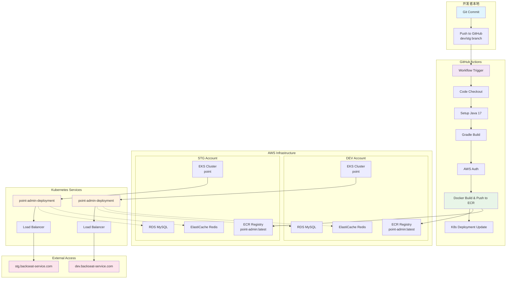
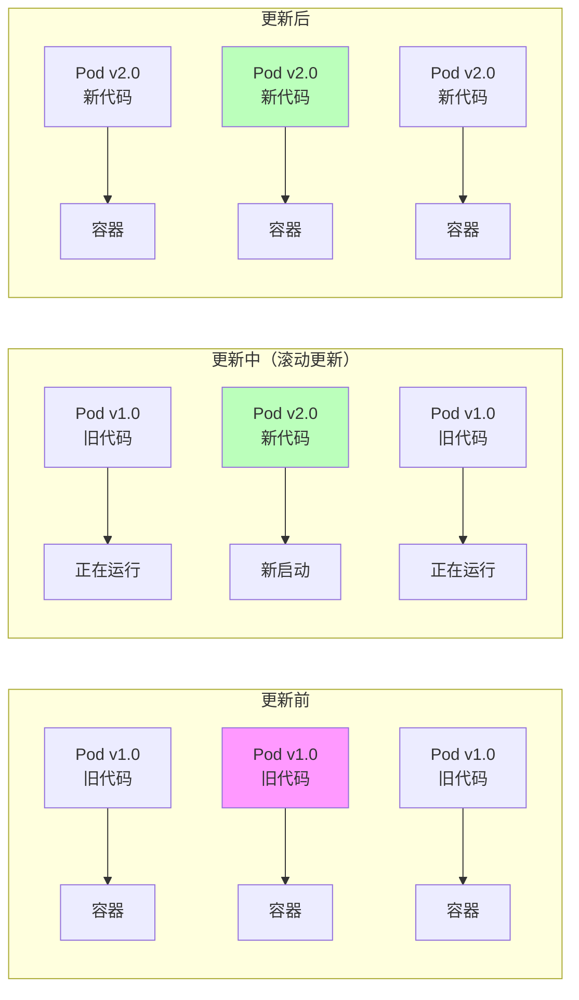
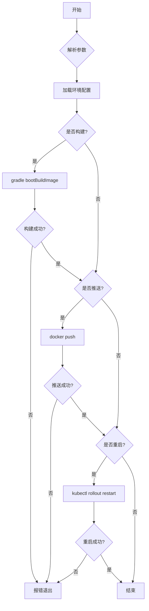
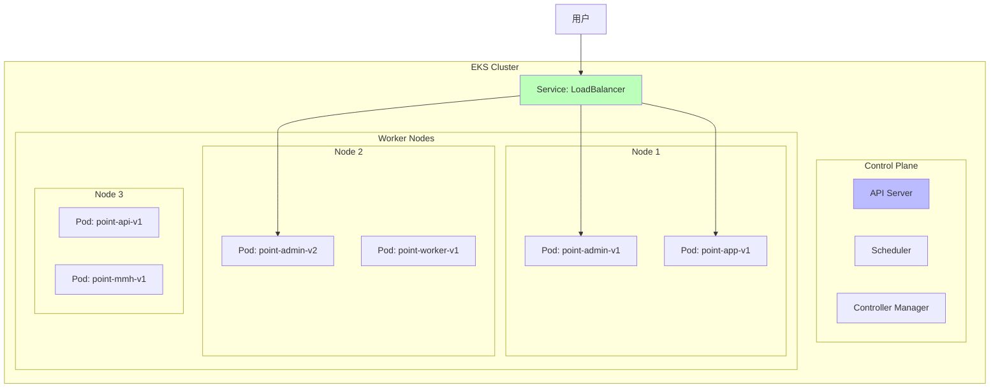
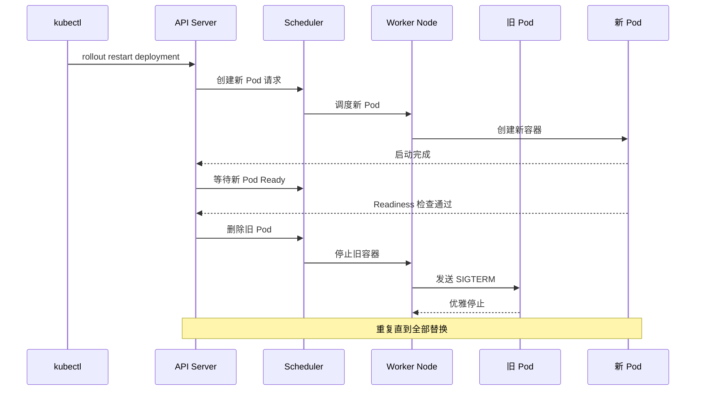

# 从 Git Push 到上线：详解后端项目的 CI/CD 自动化部署流程

本文将会结合实际项目代码，详细解析当你执行 `git push` 后，后端代码如何自动构建 Docker 镜像并部署到 Kubernetes 集群的完整流程。

## 目录

- [一、项目背景](#一项目背景)
- [二、整体架构](#二整体架构)
- [三、触发机制详解](#三触发机制详解)
- [四、构建流程解析](#四构建流程解析)
- [五、部署脚本剖析](#五部署脚本剖析)
- [六、ECR 与 EKS 的作用](#六ecr-与eks-的作用)
- [七、完整调用链追踪](#七完整调用链追踪)
- [八、常见问题解答](#八常见问题解答)
- [九、总结](#九总结)

> **注意**：如果点击目录无法跳转，请尝试直接滚动到对应章节。不同 Markdown 阅读器对中文和特殊字符的锚点处理可能不同。

---

## 一、项目背景

在后端开发中，自动化部署相比前端更为复杂，涉及编译、打包、容器化、容器编排等多个环节。本文将以一个实际的后端项目为例，详细介绍从代码提交到服务可用的完整 CI/CD 流程。

**项目技术栈：**

| 技术分类 | 具体技术 |
|---------|---------|
| 后端框架 | Spring Boot + Kotlin/Java |
| 构建工具 | Gradle 7.6 |
| 容器化 | Docker |
| CI/CD | GitHub Actions |
| 容器编排 | Amazon EKS (Kubernetes) |
| 镜像仓库 | Amazon ECR |
| 基础设施 | AWS (RDS, ElastiCache, S3, SQS/SNS) |

---

## 二、整体架构


**架构说明：**
- 开发者推送代码到 GitHub 的 dev 或 stg 分支
- GitHub Actions 自动触发 CI/CD 工作流
- 代码编译打包成 Docker 镜像
- 镜像推送到对应环境的 ECR 仓库
- Kubernetes 集群拉取新镜像并滚动更新 Pod
- 用户通过 LoadBalancer 和域名访问服务

---

## 三、触发机制详解

### 3.1 GitHub Actions 工作流结构

后端项目采用模块化的工作流设计，包含两类文件：

**服务级工作流文件**（如 `point-admin.yml`）：
- 每个微服务有独立的配置文件
- 定义该服务的触发条件
- 调用核心模板进行实际部署

**核心模板文件**（`internal_cicd.yml`）：
- 可被多个服务调用的通用部署流程
- 包含完整的构建、推送、部署步骤
- 通过参数区分不同服务和环境

### 3.2 服务级工作流配置解析

```yaml
# .github/workflows/point-admin.yml
name: On push for point-admin

on:
  push:
    branches: [dev, stg]  # 只有推送到 dev 或 stg 分支才触发
    paths:                # 路径监控：只有特定文件变更才触发
      - "point-common/**"      # 公共模块变更（影响所有服务）
      - "point-admin/**"       # admin 模块变更
      - ".github/workflows/point-admin.yml"  # 工作流配置变更
      - ".github/workflows/internal_cicd.yml" # 核心模板变更
      - "scripts/**"           # 部署脚本变更

jobs:
  deploy:
    # 调用核心模板
    uses: ./.github/workflows/internal_cicd.yml
    with:
      project: point-admin    # 传入项目名称
      target: ${{ github.ref_name }}   # 传入环境（dev 或 stg）
    secrets:
      AWS_ACCESS_KEY_ID: ${{ secrets.AWS_ACCESS_KEY_ID }}
      AWS_SECRET_ACCESS_KEY: ${{ secrets.AWS_SECRET_ACCESS_KEY }}
```

**代码详解：**

| 配置项 | 说明 |
|--------|------|
| `on.push.branches` | 指定触发工作流的分支列表 |
| `on.push.paths` | 路径监控，只有这些路径的文件变更才触发 |
| `uses: ./.github/workflows/internal_cicd.yml` | 调用核心模板文件 |
| `with.project` | 传入要部署的项目名称 |
| `with.target` | 传入目标环境（dev/stg） |
| `secrets` | 传入 AWS 认证密钥 |

### 3.3 核心模板工作流配置解析

```yaml
# .github/workflows/internal_cicd.yml
name: Internal deploy workflow

on:
  workflow_call:  # 作为可重用工作流，被其他工作流调用
    inputs:
      project:
        type: string
        required: true
        description: Deploy project
      target:
        type: string
        required: true
        description: Deploy target environment
    secrets:
      AWS_ACCESS_KEY_ID:
        required: true
      AWS_SECRET_ACCESS_KEY:
        required: true

jobs:
  build:
    environment:
      name: ${{ github.ref_name }}
    runs-on: ubuntu-latest
    steps:
      - name: Checkout
        uses: actions/checkout@v4

      - name: Set up Java
        uses: actions/setup-java@v4
        with:
          distribution: 'temurin'
          java-version: '17'
          cache: 'gradle'

      - name: Set up gradle
        uses: gradle/gradle-build-action@v2
        with:
          gradle-version: 7.6

      - name: Environments
        run: |
          CLUSTER_NAME=point
          ENVIRONMENT=${{ inputs.target }}

          case $ENVIRONMENT in
          dev)
            AWS_ROLE_ARN=arn:aws:iam::123456789012:role/cicd-deploy-role
            ;;
          stg)
            AWS_ROLE_ARN=arn:aws:iam::210987654321:role/cicd-deploy-role
            ;;
          *)
            echo "Not support env: $ENVIRONMENT"
            exit 1
          esac

          cat >> $GITHUB_ENV <<EOF
          PROJECT_NAME=${{ inputs.project }}
          ENVIRONMENT=$ENVIRONMENT
          CLUSTER_NAME=$CLUSTER_NAME
          AWS_ROLE_ARN=$AWS_ROLE_ARN
          EOF
```

**代码详解：**

| 配置项 | 说明 |
|--------|------|
| `workflow_call` | 声明这是一个可被调用的工作流模板 |
| `inputs` | 定义输入参数（项目名、目标环境） |
| `secrets` | 定义需要传入的密钥 |
| `case $ENVIRONMENT in` | 根据环境选择不同的 AWS 账号角色 |
| `>> $GITHUB_ENV` | 将变量写入环境变量文件 |

### 3.4 环境变量动态设置

```yaml
- name: Environments
  run: |
    # ${GITHUB_REF##*/} 是 bash 语法，提取分支名
    # 例如 refs/heads/dev 变成 dev
    BRANCH_NAME=${GITHUB_REF##*/}
    
    # case 语句：根据分支名设置不同的 AWS 角色
    case "$BRANCH_NAME" in
    dev)
      # 开发环境使用账号 A 的 IAM 角色
      AWS_ROLE_ARN=arn:aws:iam::123456789012:role/cicd-deploy-role
      ;;
    stg)
      # 预发布环境使用账号 B 的 IAM 角色
      AWS_ROLE_ARN=arn:aws:iam::210987654321:role/cicd-deploy-role
      ;;
    *)
      echo "Not support env: $BRANCH_NAME"
      exit 1
    esac
    
    # 将变量写入 GITHUB_ENV，供后续步骤使用
    cat >> $GITHUB_ENV <<EOF
    BRANCH_NAME=${GITHUB_REF##*/}
    AWS_ROLE_ARN=$AWS_ROLE_ARN
    EOF
```

**关键点解析：**

| 语法 | 说明 | 示例 |
|------|------|------|
| `${GITHUB_REF##*/}` | bash 字符串截取，删除最长匹配的 `*/` | `refs/heads/dev` → `dev` |
| `case ... in ... esac` | bash 条件分支语句 | 根据分支名选择不同配置 |
| `>> $GITHUB_ENV` | 将变量写入 GitHub 环境变量文件 | 后续步骤可通过 `$VAR` 读取 |

---

## 四、构建流程解析

### 4.1 AWS 认证配置

```yaml
- name: Configure AWS Credentials
  uses: aws-actions/configure-aws-credentials@v1.5.10
  with:
    # 从 GitHub Secrets 读取 AWS 访问密钥
    aws-access-key-id: ${{ secrets.AWS_ACCESS_KEY_ID }}
    aws-secret-access-key: ${{ secrets.AWS_SECRET_ACCESS_KEY }}
    aws-region: ap-northeast-1
    # 切换到对应的 IAM 角色
    role-to-assume: ${{ env.AWS_ROLE_ARN }}
    # 角色有效期 15 分钟
    role-duration-seconds: 900
    role-session-name: cicd
    role-skip-session-tagging: true
```

**为什么要使用 IAM 角色？**

| 优势 | 说明 |
|------|------|
| 安全性 | 避免长期密钥暴露，使用临时凭证 |
| 权限最小化 | 不同环境使用不同角色，权限隔离 |
| 可审计 | 所有操作可追溯到具体角色会话 |

### 4.2 构建阶段

```yaml
- name: Build
  run: |
    cd $PROJECT_NAME
    ../scripts/deploy.sh $ENVIRONMENT -b
```

`deploy.sh -b` 执行的具体操作：

```bash
# scripts/deploy.sh 中的 build 函数
function build() {
  echo "build"
  
  cd $BUILD_DIR
  ENVIRONMENT=$ENVIRONMENT \
    BUILD_DOCKER_IMAGE_NAME=$BUILD_DOCKER_IMAGE_NAME \
    BUILD_DOCKER_IMAGE_VERSION=$BUILD_DOCKER_IMAGE_VERSION \
    gradle bootBuildImage -x test --stacktrace
}
```

**Gradle 构建命令详解：**

| 参数 | 说明 |
|------|------|
| `bootBuildImage` | Spring Boot 插件命令，构建 OCI 镜像 |
| `-x test` | 跳过测试阶段，加快构建速度 |
| `--stacktrace` | 显示详细错误堆栈信息 |
| `ENVIRONMENT` | 环境标识，用于配置选择 |
| `BUILD_DOCKER_IMAGE_NAME` | 镜像名称（如 ECR 仓库地址） |
| `BUILD_DOCKER_IMAGE_VERSION` | 镜像版本标签 |

### 4.3 Docker 镜像推送

```yaml
- name: Login to Amazon ECR
  id: login-ecr
  uses: aws-actions/amazon-ecr-login@v1

- name: Docker push
  run: |
    cd $PROJECT_NAME
    ../scripts/deploy.sh $ENVIRONMENT -p
```

`deploy.sh -p` 执行的具体操作：

```bash
# scripts/deploy.sh 中的 docker_push 函数
function docker_push() {
  URI=$BUILD_DOCKER_IMAGE_NAME:$BUILD_DOCKER_IMAGE_VERSION
  echo "docker push $URI"
  docker push $URI
}
```

**推送流程说明：**
1. 登录到对应环境的 ECR 仓库
2. 组合完整的镜像 URI（仓库地址：标签）
3. 执行 `docker push` 推送到 ECR

### 4.4 Kubernetes 部署更新

```yaml
- name: Install kubectl
  uses: azure/setup-kubectl@v1

- name: K8s restart
  run: |
    aws eks update-kubeconfig --name $CLUSTER_NAME
    cd $PROJECT_NAME
    ../scripts/deploy.sh $ENVIRONMENT -k
```

`deploy.sh -k` 执行的具体操作：

```bash
# scripts/deploy.sh 中的 k8s_restart 函数
function k8s_restart() {
  echo "Restart k8s deployment: $K8S_DEPLOYMENT"
  kubectl rollout restart deployment $K8S_DEPLOYMENT
}
```

**滚动更新机制：**


---

## 五、部署脚本剖析

### 5.1 deploy.sh 脚本完整解析

```bash
#!/bin/bash
# scripts/deploy.sh

# ============================================
# 第一部分：帮助信息
# ============================================
function show_help() {
  cat <<EOF
usage: $0 <options> <environment>

options:
 -h or --help ... show help
 -b or --build ... do build
 -p or --push  ... do docker push after build
 -k or --restart-deployment ... restart k8s deployment
 -v <version> ... specify docker image version

example:
build image, docker push, and rolling update to dev:
./deploy.sh dev -b -p -k
EOF
}

# ============================================
# 第二部分：核心函数定义
# ============================================

# 构建函数
function build() {
  echo
  echo "build"

  cd $BUILD_DIR
  ENVIRONMENT=$ENVIRONMENT \
    BUILD_DOCKER_IMAGE_NAME=$BUILD_DOCKER_IMAGE_NAME \
    BUILD_DOCKER_IMAGE_VERSION=$BUILD_DOCKER_IMAGE_VERSION \
    gradle bootBuildImage -x test --stacktrace
}

# 推送函数
function docker_push() {
  URI=$BUILD_DOCKER_IMAGE_NAME:$BUILD_DOCKER_IMAGE_VERSION
  echo
  echo "docker push $URI"
  docker push $URI
}

# K8s 重启函数
function k8s_restart() {
  echo
  echo "Restart k8s deployment: $K8S_DEPLOYMENT"
  kubectl rollout restart deployment $K8S_DEPLOYMENT
}

# ============================================
# 第三部分：初始化变量
# ============================================
BUILD_DIR=$(pwd)
ENV_DIR=$(cd $BUILD_DIR/deploy/env; pwd)

ENVIRONMENT=
BUILD_DOCKER_IMAGE_VERSION_ARG=

DO_BUILD=
DO_DOCKER_PUSH=
DO_K8S_RESTART=
DO_SHOW_HELP=

# ============================================
# 第四部分：解析命令行参数
# ============================================
while true; do
  if [ -z $1 ]; then
    break
  fi
  case $1 in
    -h|--help) DO_SHOW_HELP=1 ;;
    -b|--build) DO_BUILD=1 ;;
    -p|--push) DO_DOCKER_PUSH=1 ;;
    -k|--restart-deployment) DO_K8S_RESTART=1 ;;
    "-v") shift; BUILD_DOCKER_IMAGE_VERSION_ARG=$1 ;;
    *)
      if [ -z $ENVIRONMENT ]; then
        ENVIRONMENT=$1
      fi
      ;;
  esac
  shift
done

# ============================================
# 第五部分：参数验证
# ============================================
if [[ -z $ENVIRONMENT ]] || [[ "$DO_SHOW_HELP" = 1 ]]; then
  show_help
  exit 1
fi

# ============================================
# 第六部分：加载环境配置文件
# ============================================
envfile=$ENV_DIR/$ENVIRONMENT

if [ ! -f $envfile ]; then
  echo "env file not found: $envfile"
  exit 1
fi

source $envfile

# ============================================
# 第七部分：版本号覆盖
# ============================================
if [ ! -z $BUILD_DOCKER_IMAGE_VERSION_ARG ]; then
  BUILD_DOCKER_IMAGE_VERSION=$BUILD_DOCKER_IMAGE_VERSION_ARG
fi

# ============================================
# 第八部分：执行构建
# ============================================
if [ "$DO_BUILD" = 1 ]; then
  build

  if [ $? != 0 ]; then
    echo "build failed. aborted."
    exit 1
  fi
fi

# ============================================
# 第九部分：执行推送
# ============================================
if [ "$DO_DOCKER_PUSH" = "1" ]; then
  docker_push

  if [ $? != 0 ]; then
    echo "push failed. aborted."
    exit 1
  fi
fi

# ============================================
# 第十部分：执行 K8s 重启
# ============================================
if [ "$DO_K8S_RESTART" = "1" ]; then
  k8s_restart

  if [ $? != 0 ]; then
    echo "restart failed. aborted."
    exit 1
  fi
fi
```

### 5.2 环境配置文件

```bash
# deploy/env/dev
# 开发环境配置
BUILD_DOCKER_IMAGE_NAME=123456789012.dkr.ecr.ap-northeast-1.amazonaws.com/point-admin
BUILD_DOCKER_IMAGE_VERSION=latest
K8S_DEPLOYMENT=point-admin-deployment
```

```bash
# deploy/env/stg
# 预发布环境配置
BUILD_DOCKER_IMAGE_NAME=210987654321.dkr.ecr.ap-northeast-1.amazonaws.com/point-admin
BUILD_DOCKER_IMAGE_VERSION=latest
K8S_DEPLOYMENT=point-admin-deployment
```

### 5.3 脚本执行流程图



---

<a id="六 ecr-与 eks-的作用"></a>
## 六、ECR 与 EKS 的作用

### 6.1 ECR 容器镜像仓库的作用

ECR（Elastic Container Registry）是 AWS 的 Docker 镜像仓库服务，在这里扮演镜像存储和分发的角色。

**推送后的 ECR 镜像结构：**

```bash
# ECR 仓库地址
123456789012.dkr.ecr.ap-northeast-1.amazonaws.com/point-admin

# 镜像标签
- latest                    # 最新版本
- 20240318-1                # 带版本号的镜像
- 20240318-2                # 多次构建的版本

# 镜像层结构
point-admin:latest
 Layer 1: Base OS (Ubuntu 20.04)
 Layer 2: JDK 17
 Layer 3: Application JAR
 Layer 4: Configuration
```

**为什么用 ECR 存后端镜像？**

| 优势 | 说明 |
|------|------|
| 与 EKS 集成 | 原生支持 Kubernetes 拉取镜像 |
| 安全性 | 支持镜像扫描、加密存储 |
| 高可用 | 跨可用区存储，99.95% 可用性 |
| 生命周期管理 | 可配置自动清理旧镜像 |

### 6.2 EKS Kubernetes 集群的作用

EKS（Elastic Kubernetes Service）是 AWS 的托管 Kubernetes 服务，在这里扮演容器编排平台的角色。

**Kubernetes 部署架构：**



**Kubernetes 部署配置示例：**

```yaml
# point-admin-deployment.yaml
apiVersion: apps/v1
kind: Deployment
metadata:
  name: point-admin-deployment
spec:
  replicas: 3                    # 运行 3 个副本
  selector:
    matchLabels:
      app: point-admin
  template:
    metadata:
      labels:
        app: point-admin
    spec:
      containers:
      - name: point-admin
        image: 123456789012.dkr.ecr.ap-northeast-1.amazonaws.com/point-admin:latest
        ports:
        - containerPort: 8080
        env:
        - name: SPRING_PROFILES_ACTIVE
          value: "dev"
        resources:
          requests:
            memory: "512Mi"
            cpu: "250m"
          limits:
            memory: "1Gi"
            cpu: "500m"
        livenessProbe:
          httpGet:
            path: /actuator/health/liveness
            port: 8080
          initialDelaySeconds: 60
          periodSeconds: 10
        readinessProbe:
          httpGet:
            path: /actuator/health/readiness
            port: 8080
          initialDelaySeconds: 30
          periodSeconds: 5
---
apiVersion: v1
kind: Service
metadata:
  name: point-admin-service
spec:
  type: LoadBalancer
  selector:
    app: point-admin
  ports:
  - port: 80
    targetPort: 8080
```

### 6.3 滚动更新机制详解



---

## 七、完整调用链追踪

### 当你执行 `git push origin dev`

sequenceDiagram
    participant Dev as 开发者
    participant GH as GitHub
    participant GA as GitHub Actions
    participant Gradle as Gradle
    participant ECR as ECR 仓库
    participant EKS as EKS 集群

    Dev->>GH: git push dev
    Note over Dev,GH: 触发 CI/CD 流程
    
    GH->>GA: 触发 point-admin.yml 工作流
    
    GA->>GA: Checkout 代码
    Note over GA: git clone 项目代码
    
    GA->>GA: 设置环境变量
    Note over GA: BRANCH_NAME=dev<br/>AWS_ROLE_ARN=arn:aws:iam::123456789012:role/...
    
    GA->>GA: Setup Java 17
    GA->>GA: Setup Gradle 7.6
    
    GA->>Gradle: ./gradlew bootBuildImage
    Note over Gradle: 编译 Java 代码<br/>运行测试<br/>打包 JAR<br/>构建 Docker 镜像
    Gradle-->>GA: 构建完成
    
    GA->>GA: Configure AWS Credentials
    GA->>ECR: docker login
    
    GA->>ECR: docker push point-admin:latest
    Note over ECR: 镜像已更新
    
    GA->>EKS: aws eks update-kubeconfig
    GA->>EKS: kubectl rollout restart deployment
    
    EKS->>EKS: 创建新 Pod（拉取新镜像）
    EKS->>EKS: 等待新 Pod Ready
    EKS->>EKS: 停止旧 Pod
    Note over EKS: 滚动更新完成
    
    EKS-->>GA: 部署完成
    GA-->>Dev: ✅ 部署成功通知
    
    subgraph "更新后"
        E1[Pod v2.0<br/>新代码] --> F1[容器]
        E2[Pod v2.0<br/>新代码] --> F2[容器]
        E3[Pod v2.0<br/>新代码] --> F3[容器]
    end
    
    style A2 fill:#f9f
    style C2 fill:#bfb
    style E2 fill:#bfb

---

**实际执行的命令（带输出示例）**

#### 1. 构建命令

```bash
$ cd point-admin
$ ../scripts/deploy.sh dev -b

build
> Task :compileKotlin
> Task :compileJava
> Task :processResources
> Task :classes
> Task :bootJar
> Task :bootBuildImage

Building image: 123456789012.dkr.ecr.ap-northeast-1.amazonaws.com/point-admin:latest

Successfully built image '123456789012.dkr.ecr.ap-northeast-1.amazonaws.com/point-admin:latest'

BUILD SUCCESSFUL in 2m 15s
```

#### 2. 推送命令

```bash
$ ../scripts/deploy.sh dev -p

docker push 123456789012.dkr.ecr.ap-northeast-1.amazonaws.com/point-admin:latest
The push refers to repository [123456789012.dkr.ecr.ap-northeast-1.amazonaws.com/point-admin]
abc123: Pushed
def456: Pushed
ghi789: Pushed
latest: digest: sha256:abc123... size: 2420
```

#### 3. K8s 重启命令

```bash
$ ../scripts/deploy.sh dev -k

Restart k8s deployment: point-admin-deployment
deployment.apps/point-admin-deployment restarted

# 查看滚动更新状态
$ kubectl rollout status deployment point-admin-deployment
Waiting for deployment "point-admin-deployment" rollout to finish: 1 out of 3 new replicas have been updated...
Waiting for deployment "point-admin-deployment" rollout to finish: 2 out of 3 new replicas have been updated...
deployment "point-admin-deployment" successfully rolled out
```

---

## 八、常见问题解答

### Q1: 如何确认部署成功？

**方法 1：查看 Pod 状态**

```bash
# 查看 Pod 运行状态
kubectl get pods -l app=point-admin

# 输出示例
NAME                                     READY   STATUS    RESTARTS   AGE
point-admin-deployment-abc123-xyz789     1/1     Running   0          2m
point-admin-deployment-def456-uvw123     1/1     Running   0          2m
point-admin-deployment-ghi789-rst456     1/1     Running   0          2m
```

**方法 2：查看部署历史**

```bash
# 查看部署历史
kubectl rollout history deployment point-admin-deployment

# 输出示例
deployment.apps/point-admin-deployment 
REVISION  CHANGE-CAUSE
1         <none>
2         <none>
```

**方法 3：访问健康检查端点**

```bash
# 通过 LoadBalancer 访问健康检查
curl https://dev.backseat-service.com/actuator/health

# 输出示例
{"status":"UP"}
```

### Q2: 部署失败怎么办？

**排查步骤：**

```bash
# 1. 查看 GitHub Actions 日志
# 在 GitHub 仓库的 Actions 标签页查看详细日志

# 2. 查看 Pod 事件
kubectl describe pod <pod-name>

# 3. 查看 Pod 日志
kubectl logs <pod-name>

# 4. 查看部署状态
kubectl rollout status deployment point-admin-deployment

# 5. 检查镜像是否存在
aws ecr describe-images --repository-name point-admin --image-ids imageTag=latest
```

### Q3: 如何回滚到旧版本？

**方法 1：使用 kubectl 回滚**

```bash
# 查看部署历史
kubectl rollout history deployment point-admin-deployment

# 回滚到上一个版本
kubectl rollout undo deployment point-admin-deployment

# 回滚到指定版本
kubectl rollout undo deployment point-admin-deployment --to-revision=2
```

**方法 2：重新部署旧镜像**

```bash
# 修改 Deployment 镜像版本
kubectl set image deployment/point-admin-deployment \
  point-admin=123456789012.dkr.ecr.ap-northeast-1.amazonaws.com/point-admin:20240318-1
```

### Q4: 如何查看镜像构建日志？

```bash
# 在 GitHub Actions 中查看构建日志
# 展开 "Build" 步骤，可以看到完整的 Gradle 构建输出

# 本地构建测试
cd point-admin
./gradlew bootBuildImage --stacktrace
```

### Q5: 如何优化构建速度？

**启用 Gradle 缓存：**

```yaml
- name: Cache Gradle
  uses: actions/cache@v3
  with:
    path: |
      ~/.gradle/caches
      ~/.gradle/wrapper
    key: ${{ runner.os }}-gradle-${{ hashFiles('**/*.gradle*') }}
    restore-keys: |
      ${{ runner.os }}-gradle-
```

**使用并行构建：**

```bash
# gradle.properties
org.gradle.parallel=true
org.gradle.caching=true
org.gradle.daemon=true
```

### Q6: 不同环境的配置如何管理？

**Spring Boot 多环境配置：**

```yaml
# application-dev.yaml
spring:
  datasource:
    url: jdbc:mysql://dev-database:3306/app
  redis:
    host: dev-redis

# application-stg.yaml
spring:
  datasource:
    url: jdbc:mysql://stg-database:3306/app
  redis:
    host: stg-redis

# application-prd.yaml
spring:
  datasource:
    url: jdbc:mysql://prd-database:3306/app
  redis:
    host: prd-redis
```

**通过环境变量激活配置：**

```yaml
# Kubernetes Deployment 中设置
env:
- name: SPRING_PROFILES_ACTIVE
  value: "dev"
```

---

## 九、总结

### 9.1 核心流程回顾

```bash
git push dev
     ↓
GitHub Actions 触发
     ↓
编译 Java 代码 (gradle build)
     ↓
构建 Docker 镜像 (bootBuildImage)
     ↓
推送到 ECR (docker push)
     ↓
更新 Kubernetes (kubectl rollout restart)
     ↓
滚动更新 Pod
     ↓
部署完成 ✅
```

### 9.2 关键技术点详解

| 阶段 | 技术 | 作用 | 关键命令 |
|------|------|------|----------|
| 触发 | GitHub Actions | 自动化流程编排 | `on: push: branches: [dev]` |
| 编译 | Gradle | Java 代码编译打包 | `gradle bootBuildImage` |
| 容器化 | Docker | 打包成容器镜像 | `docker build / bootBuildImage` |
| 认证 | AWS IAM Role | 安全访问 AWS | `role-to-assume: ${{ env.AWS_ROLE_ARN }}` |
| 存储 | Amazon ECR | 镜像仓库 | `docker push` |
| 编排 | Kubernetes | 容器编排 | `kubectl rollout restart` |
| 脚本 | Bash | 自动化部署 | `deploy.sh -b -p -k` |

### 9.3 前后端部署对比

| 维度 | 前端 | 后端 |
|------|------|------|
| 构建产物 | 静态文件（HTML/JS/CSS） | Docker 镜像 |
| 部署目标 | S3 + CloudFront | EKS (Kubernetes) |
| 构建命令 | npm run build | gradle bootBuildImage |
| 部署方式 | aws s3 sync | kubectl rollout restart |
| 运行环境 | 浏览器 | 容器 |
| 更新机制 | 文件替换 | 滚动更新 |
| 版本管理 | 文件覆盖 | 镜像标签 |

### 9.4 自动化带来的收益

| 收益 | 说明 |
|------|------|
| 零人工干预 | 代码提交即部署，减少人为错误 |
| 环境隔离 | dev/stg 使用不同 AWS 账号，互不影响 |
| 滚动更新 | 服务不中断，用户体验无感知 |
| 快速回滚 | `kubectl rollout undo` 秒级恢复 |
| 镜像版本管理 | ECR 保留历史版本，便于追溯 |

### 9.5 最佳实践建议

**1. 分支策略**

```bash
dev 分支   → 开发环境自动部署
stg 分支   → 预发布环境自动部署
main 分支  → 生产环境手动触发
```

**2. 镜像版本管理**

```bash
# 使用带时间戳的版本号
BUILD_DOCKER_IMAGE_VERSION=20240318-${GITHUB_RUN_NUMBER}

# 保留 latest 标签指向最新版本
# 同时保留具体版本号用于回滚
```

**3. 健康检查配置**

```yaml
# Kubernetes 探针配置
livenessProbe:
  httpGet:
    path: /actuator/health/liveness
  initialDelaySeconds: 60
  
readinessProbe:
  httpGet:
    path: /actuator/health/readiness
  initialDelaySeconds: 30
```

**4. 资源限制**

```yaml
resources:
  requests:
    memory: "512Mi"
    cpu: "250m"
  limits:
    memory: "1Gi"
    cpu: "500m"
```

**5. 监控告警**

| 监控项 | 告警条件 |
|--------|----------|
| Pod 重启次数 | 5 分钟内超过 3 次 |
| Pod 启动失败 | 立即告警 |
| 镜像拉取失败 | 立即告警 |
| 服务健康检查失败 | 连续 3 次失败 |

---

## 参考资料

- [GitHub Actions 文档](https://docs.github.com/en/actions)
- [Spring Boot Gradle 插件](https://docs.spring.io/spring-boot/docs/current/gradle-plugin/reference/htmlsingle/)
- [AWS ECR 文档](https://docs.aws.amazon.com/AmazonECR/latest/userguide/what-is-ecr.html)
- [AWS EKS 文档](https://docs.aws.amazon.com/eks/latest/userguide/what-is-eks.html)
- [Kubernetes 滚动更新](https://kubernetes.io/docs/concepts/workloads/controllers/deployment/#rolling-update-deployment)

---

> 本文中的所有代码均来自实际项目，经过生产环境验证。希望能帮助读者理解后端项目的 CI/CD 自动化部署流程！
> 
> 如果你觉得这篇文章对你有帮助，欢迎点赞、收藏、转发！有问题可以在评论区留言交流。
