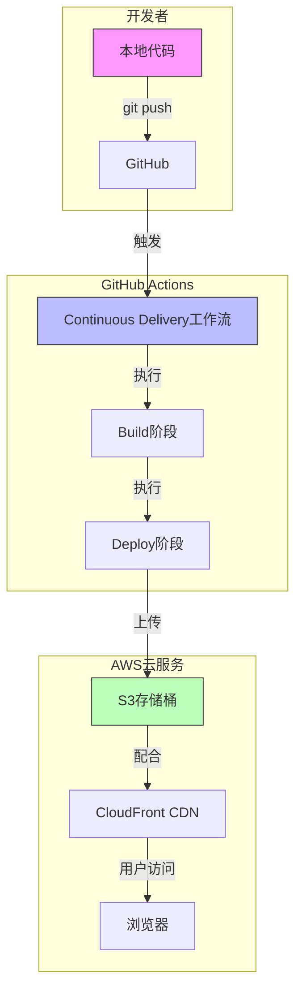
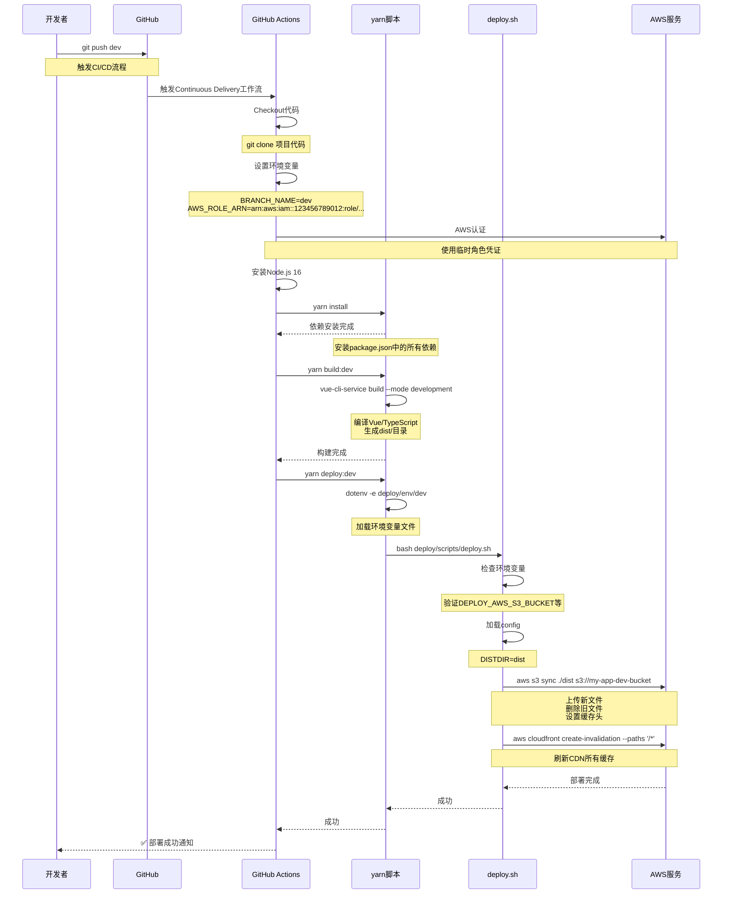

# 从 Git Push 到上线：详解前端项目的 CI/CD 自动化部署流程

本文将会结合实际项目代码，详细解析当你执行 `git push` 后，代码如何自动部署到服务器的完整流程。

## 目录
- [一、项目背景](#一项目背景)
- [二、整体架构](#二整体架构)
- [三、触发机制详解](#三触发机制详解)
- [四、构建流程解析](#四构建流程解析)
- [五、部署脚本剖析](#五部署脚本剖析)
- [六、S3 与 CloudFront 的作用](#六s3与cloudfront的作用)
- [七、完整调用链追踪](#七完整调用链追踪)
- [八、常见问题解答](#八常见问题解答)
- [九、总结](#九总结)

---

## 一、项目背景

在现代前端开发中，自动化部署已经成为标配。本文将以一个实际项目为例，详细介绍从代码提交到线上访问的完整 CI/CD 流程。

**项目技术栈：**
- 前端框架：Vue 2 + TypeScript
- 包管理器：Yarn
- CI/CD：GitHub Actions
- 云服务：AWS S3 + CloudFront
- 部署脚本：Bash

---

## 二、整体架构



---

## 三、触发机制详解

### 3.1 GitHub Actions 配置文件解析

```yaml
# .github/workflows/continuous-delivery.yml
name: Continuous Delivery

#  触发条件配置
on:
  push:
    branches: [dev, stg]  # 只有推送到 dev 或 stg 分支才触发

jobs:
  build:
    # 动态设置环境名称（dev 或 stg）
    environment:
      name: ${{ github.ref_name }}
    runs-on: ubuntu-latest
    steps:
      # 步骤 1: 拉取代码
      - name: Checkout
        uses: actions/checkout@v2
        # 这个 action 会执行 git clone 命令
```

**代码详解：**

- `on.push.branches`: 指定触发工作流的分支
- `${{ github.ref_name }}`: GitHub 内置变量，表示当前分支名
- `actions/checkout@v2`: GitHub 官方 action，用于拉取代码

### 3.2 环境变量动态设置

```yaml
- name: Environments
  run: |
    # ${GITHUB_REF##*/} 是 bash 语法，提取分支名
    # 例如 refs/heads/dev 变成 dev
    BRANCH_NAME=${GITHUB_REF##*/}
    
    # case语句：根据分支名设置不同的AWS角色
    case "$BRANCH_NAME" in
    dev)
      # 开发环境使用账号 A 的 IAM 角色
      AWS_ROLE_ARN=arn:aws:iam::123456789012:role/cicd-deploy-role
      ;;
    stg)
      # 预发布环境使用账号 B 的 IAM 角色
      AWS_ROLE_ARN=arn:aws:iam::210987654321:role/cicd-deploy-role
      ;;
    *)
      echo "Not support env: $BRANCH_NAME"
      exit 1
    esac
    
    # 将变量写入 GITHUB_ENV，供后续步骤使用
    cat >> $GITHUB_ENV <<EOF
    BRANCH_NAME=${GITHUB_REF##*/}
    AWS_ROLE_ARN=$AWS_ROLE_ARN
    EOF
```

**关键点解析：**

- `${GITHUB_REF##*/}`: 这是 bash 的字符串截取语法，`##` 表示从左边删除最长匹配，`*/` 匹配到最后一个斜杠
- `case` 语句：实现分支判断逻辑
- `>> $GITHUB_ENV`: 将变量写入环境变量文件，后续步骤可以读取

---

## 四、构建流程解析

### 4.1 AWS 认证配置

```yaml
- name: Configure AWS Credentials
  uses: aws-actions/configure-aws-credentials@v1
  with:
    # 从 GitHub Secrets 读取 AWS 访问密钥
    aws-access-key-id: ${{ secrets.AWS_ACCESS_KEY_ID }}
    aws-secret-access-key: ${{ secrets.AWS_SECRET_ACCESS_KEY }}
    aws-region: ap-northeast-1
    # 切换到对应的 IAM 角色
    role-to-assume: ${{ env.AWS_ROLE_ARN }}
    # 角色有效期 20 分钟
    role-duration-seconds: 1200
    role-session-name: cicd-session
```

**为什么要使用 IAM 角色？**
- 避免长期密钥暴露
- 实现最小权限原则
- 不同环境使用不同角色

### 4.2 安装依赖和构建

```yaml
- name: Use Node.js
  uses: actions/setup-node@v3
  with:
    node-version: 16  # 指定 Node.js 版本

- name: Build
  run: |
    # 安装项目依赖
    yarn install
    # 根据环境执行不同的构建命令
    yarn build:${{ env.BRANCH_NAME }}
  # yarn install 会读取 package.json 安装所有依赖
  # yarn build:dev 会执行 package.json 中定义的脚本
```

### 4.3 package.json 中的脚本配置

```json
{
  "name": "frontend-app",
  "version": "1.0.0",
  "scripts": {
    // 开发环境构建
    "build:dev": "vue-cli-service build --mode development",
    // 预发布环境构建  
    "build:stg": "vue-cli-service build --mode staging",
    // 生产环境构建
    "build:prd": "vue-cli-service build --mode production",
    
    // 部署脚本（使用 dotenv 加载环境变量）
    "deploy:dev": "dotenv -e deploy/env/dev -- bash ./deploy/scripts/deploy.sh",
    "deploy:stg": "dotenv -e deploy/env/stg -- bash ./deploy/scripts/deploy.sh",
    "deploy:prd": "dotenv -e deploy/env/prd -- bash ./deploy/scripts/deploy.sh"
  },
  "dependencies": {
    "vue": "^2.6.11",
    "vue-router": "^3.1.6",
    "vuex": "^3.3.0"
  },
  "devDependencies": {
    "@vue/cli-service": "~4.3.0",
    "typescript": "~3.8.3",
    "dotenv-cli": "^4.0.0"
  }
}
```

**脚本详解：**
- `vue-cli-service build`: Vue CLI 的构建命令
- `--mode development`: 指定构建模式，会加载对应的 `.env` 文件
- `dotenv -e deploy/env/dev`: 加载指定路径的环境变量文件
- `bash ./deploy/scripts/deploy.sh`: 执行部署脚本

---

## 五、部署脚本剖析

### 5.1 部署脚本完整解析

```bash
#!/bin/bash
# deploy/scripts/deploy.sh

# 【第一部分】环境变量检查
if [ -z $DEPLOY_AWS_S3_BUCKET ]; then
  cat <<EOF
error: Following environments must be set:
DEPLOY_AWS_S3_BUCKET
DEPLOY_AWS_CLOUDFRONT_DISTRIBUTION_ID

Following environments are optional:
DEPLOY_AWS_PROFILE
EOF
  exit 1
fi

# 参数说明：
# -z 判断变量是否为空
# <<EOF 是 here document 语法，用于输出多行文本
# exit 1 表示以错误状态退出

# 【第二部分】加载配置文件
# $(dirname $0) 获取脚本所在目录
# 两次 dirname 获取上级目录的上级目录
BASEDIR=$(dirname $(dirname $0))
# source 命令加载配置文件
source $BASEDIR/config

# 示例：
# 如果脚本在 /project/deploy/scripts/deploy.sh
# BASEDIR = /project
# 加载 /project/config

# 【第三部分】显示配置信息（调试用）
echo "DEPLOY_AWS_PROFILE=$DEPLOY_AWS_PROFILE"
echo "DEPLOY_AWS_S3_BUCKET=$DEPLOY_AWS_S3_BUCKET"
echo "DEPLOY_AWS_CLOUDFRONT_DISTRIBUTION_ID=$DEPLOY_AWS_CLOUDFRONT_DISTRIBUTION_ID"

# 【第四部分】设置 AWS Profile
if [ ! -z $DEPLOY_AWS_PROFILE ]; then
  # 如果指定了 AWS Profile，设置环境变量
  export AWS_PROFILE=$DEPLOY_AWS_PROFILE
fi

# 【第五部分】列出当前目录内容（调试用）
ls -la

# 【第六部分】同步文件到 S3（核心部署命令）
aws s3 sync ./$DISTDIR s3://$DEPLOY_AWS_S3_BUCKET \
  --cache-control="no-cache" \
  --delete \
  --quiet

# aws s3 sync 命令详解：
# - sync: 同步本地目录到 S3，只上传变更的文件
# - ./$DISTDIR: 本地构建目录（如 dist/）
# - s3://$DEPLOY_AWS_S3_BUCKET: S3 存储桶地址
# - --cache-control="no-cache": 设置 HTTP 缓存头，告诉浏览器不缓存
# - --delete: 删除 S3 中本地不存在的文件（保持完全一致）
# - --quiet: 减少命令输出

# 【第七部分】刷新 CloudFront 缓存
if [ ! -z "$DEPLOY_AWS_CLOUDFRONT_DISTRIBUTION_ID" ]; then
  aws cloudfront create-invalidation \
    --distribution-id $DEPLOY_AWS_CLOUDFRONT_DISTRIBUTION_ID \
    --paths '/*'
  
  # create-invalidation 命令详解：
  # --distribution-id: CloudFront 分发 ID
  # --paths '/*': 刷新所有路径的缓存
  # 用户访问时会从 S3 获取最新文件
fi
```

### 5.2 环境配置文件

```bash
# deploy/env/dev
# 开发环境配置
DEPLOY_AWS_S3_BUCKET=my-app-dev-bucket
DEPLOY_AWS_CLOUDFRONT_DISTRIBUTION_ID=E1234567890ABC
# DEPLOY_AWS_PROFILE 可选，这里没设置
```

```bash
# deploy/env/stg
# 预发布环境配置
DEPLOY_AWS_S3_BUCKET=my-app-stg-bucket
DEPLOY_AWS_CLOUDFRONT_DISTRIBUTION_ID=E0987654321DEF
```

### 5.3 公共配置文件

```bash
# deploy/config
# 所有环境共享的配置
DISTDIR=dist  # 构建输出目录
# 可以添加其他公共配置
```

---

## 六、S3 与 CloudFront 的作用

### 6.1 S3 存储桶的作用

S3（Simple Storage Service）在这里扮演静态文件服务器的角色。

**同步后的 S3 目录结构：**

```bash
s3://my-app-dev-bucket/
├── index.html          # 入口页面
├── css/
│   ├── app.abc123.css  # 带 hash 的 CSS 文件
│   └── chunk.def456.css
├── js/
│   ├── app.xyz789.js   # 带 hash 的 JS 文件
│   └── vendor.uvw123.js
├── img/
│   ├── logo.png
│   └── background.jpg
└── fonts/
    └── custom.woff2
```

**为什么用 S3 存前端代码？**
- ✅ 高可用性（11 个 9 的 durability）
- ✅ 低成本（存储费用很低）
- ✅ 配合 CloudFront 实现全球加速
- ✅ 无需管理服务器

### 6.2 CloudFront CDN 的作用

CloudFront 是 AWS 的内容分发网络（CDN）。

**工作原理：**

```
用户请求 → 最近的边缘节点 → 有缓存？→ 直接返回
                    ↓
                无缓存
                    ↓
            回源到 S3 获取文件
                    ↓
            缓存到边缘节点
                    ↓
              返回给用户
```

**CloudFront 配置示例：**

```json
{
  "DistributionId": "E1234567890ABC",
  "DomainName": "d123.cloudfront.net",
  "Origins": {
    "Items": [
      {
        "Id": "S3-my-app-dev-bucket",
        "DomainName": "my-app-dev-bucket.s3.amazonaws.com"
      }
    ]
  },
  "CacheBehaviors": {
    "Items": [
      {
        "PathPattern": "*.js",
        "TTL": 86400,  // 缓存 1 天
        "Compress": true
      }
    ]
  }
}
```

---

## 七、完整调用链追踪

### 当你执行 `git push origin dev`

**实际执行的命令（带输出示例）**

```bash
# 1. 构建命令
$ yarn build:dev
> frontend-app@1.0.0 build:dev
> vue-cli-service build --mode development

# 输出示例
✓ Building for development...
✓ Compiled successfully in 15.2s
✓ File sizes:
  dist/js/app.abc123.js    128.5 KiB
  dist/js/vendor.def456.js  512.3 KiB
  dist/css/app.ghi789.css    42.1 KiB

# 2. 部署命令
$ yarn deploy:dev
> frontend-app@1.0.0 deploy:dev
> dotenv -e deploy/env/dev -- bash ./deploy/scripts/deploy.sh

# 输出示例
DEPLOY_AWS_PROFILE=
DEPLOY_AWS_S3_BUCKET=my-app-dev-bucket
DEPLOY_AWS_CLOUDFRONT_DISTRIBUTION_ID=E1234567890ABC

# 3. S3 同步命令（实际执行）
aws s3 sync ./dist s3://my-app-dev-bucket --cache-control="no-cache" --delete --quiet

# 4. CloudFront刷新命令
aws cloudfront create-invalidation --distribution-id E1234567890ABC --paths '/*'
{
    "Location": "https://cloudfront.amazonaws.com/2020-05-31/distribution/E1234567890ABC/invalidation/I123456",
    "Invalidation": {
        "Id": "I123456",
        "Status": "InProgress",
        "CreateTime": "2024-01-01T10:00:00Z",
        "InvalidationBatch": {
            "Paths": {
                "Quantity": 1,
                "Items": ["/*"]
            }
        }
    }
}
```

---

## 八、常见问题解答

### Q1: 如何确认部署成功？

**方法 1：访问网站验证**

```bash
# 访问开发环境地址
curl -I https://dev.myapp.com
# 应该返回 200 OK
```

**方法 2：查看 S3 文件**

```bash
# 列出 S3 中的文件
aws s3 ls s3://my-app-dev-bucket --recursive --human-readable
```

**方法 3：检查 CloudWatch 日志**

```bash
# 查看 CloudFront 日志（如果开启）
aws cloudfront get-distribution-config --id E1234567890ABC
```

### Q2: 部署失败怎么办？

**排查步骤：**

```bash
# 1. 查看 GitHub Actions 日志
# 在 GitHub 仓库的 Actions 标签页查看详细日志

# 2. 检查 S3 存储桶权限
aws s3api get-bucket-policy --bucket my-app-dev-bucket

# 3. 验证 CloudFront 分发 ID
aws cloudfront list-distributions --query "DistributionList.Items[?DomainName.contains(@,'myapp')]"

# 4. 测试 AWS 凭证
aws sts get-caller-identity  # 查看当前使用的身份
```

### Q3: 如何回滚到旧版本？

**方法 1：重新部署旧代码**

```bash
# 切换到旧版本
git checkout old-commit-hash
git push origin dev -f  # 强制推送

# GitHub Actions 会自动重新部署
```

**方法 2：手动恢复 S3 文件**

```bash
# 如果有版本控制，可以恢复旧版本
aws s3api list-object-versions --bucket my-app-dev-bucket --prefix index.html

# 复制旧版本到当前
aws s3 cp s3://my-app-dev-bucket/index.html?versionId=old-version-id s3://my-app-dev-bucket/index.html
```

### Q4: S3 存储桶的权限如何配置？

**存储桶策略示例：**

```json
{
  "Version": "2012-10-17",
  "Statement": [
    {
      "Effect": "Allow",
      "Principal": "*",  // 允许所有人访问
      "Action": "s3:GetObject",  // 只允许读取
      "Resource": "arn:aws:s3:::my-app-dev-bucket/*"  // 所有文件
    }
  ]
}
```

**跨域配置（CORS）：**

```json
[
  {
    "AllowedHeaders": ["*"],
    "AllowedMethods": ["GET", "HEAD"],
    "AllowedOrigins": ["https://myapp.com"],
    "ExposeHeaders": [],
    "MaxAgeSeconds": 3000
  }
]
```

### Q5: 如何优化构建速度？

```yaml
# 在 GitHub Actions 中启用缓存
- name: Cache node_modules
  uses: actions/cache@v3
  with:
    path: node_modules
    key: ${{ runner.os }}-node-${{ hashFiles('yarn.lock') }}
```

```json
// package.json 中配置
{
  "scripts": {
    "build:dev": "vue-cli-service build --mode development --parallel",  // 并行构建
    "prebuild": "yarn lint"  // 构建前检查
  }
}
```

---

## 九、总结

### 9.1 核心流程回顾

```bash
git push dev 
     ↓
GitHub Actions 触发
     ↓
安装依赖 (yarn install)
     ↓
构建 Vue 项目 (yarn build:dev)
     ↓
同步到 S3 (aws s3 sync)
     ↓
刷新 CloudFront (create-invalidation)
     ↓
部署完成 ✅
```

### 9.2 关键技术点详解

| 阶段 | 技术 | 作用 | 关键代码 |
|------|------|------|----------|
| 触发 | GitHub Actions | 自动化流程编排 | `on: push: branches: [dev]` |
| 认证 | AWS IAM Role | 安全访问 AWS | `role-to-assume: ${{ env.AWS_ROLE_ARN }}` |
| 构建 | Vue CLI | 编译 Vue/TypeScript | `vue-cli-service build --mode development` |
| 存储 | AWS S3 | 托管静态文件 | `aws s3 sync ./dist s3://bucket/` |
| 加速 | CloudFront | CDN分发 | `aws cloudfront create-invalidation` |
| 脚本 | Bash | 自动化部署 | `if [ -z $VAR ]; then ... fi` |

### 9.3 自动化带来的收益

- ✅ **零人工干预**：代码提交即部署，减少人为错误
- ✅ **环境隔离**：dev/stg 使用不同 AWS 账号，互不影响
- ✅ **快速回滚**：有问题秒级恢复
- ✅ **缓存控制**：用户立即看到更新
- ✅ **成本优化**：S3 + CloudFront 比传统服务器更省钱

### 9.4 最佳实践建议

**分支策略**

```bash
dev 分支  → 开发环境自动部署
stg 分支  → 预发布环境自动部署
main 分支 → 生产环境手动触发
```

**版本管理**

```json
{
  "version": "1.0.0-dev-20240318.1"  // 带环境标识的版本号
}
```

**监控告警**

```yaml
# CloudWatch 告警配置
- 部署失败告警
- S3 存储空间告警
- CloudFront 5xx 错误告警
```

---

## 参考资料

- [GitHub Actions 文档](https://docs.github.com/en/actions)
- [AWS S3 静态网站托管](https://docs.aws.amazon.com/AmazonS3/latest/userguide/WebsiteHosting.html)
- [CloudFront 缓存刷新](https://docs.aws.amazon.com/AmazonCloudFront/latest/DeveloperGuide/Invalidation.html)
- [Vue CLI 构建模式](https://cli.vuejs.org/guide/mode.html)
- [AWS CLI sync 命令详解](https://docs.aws.amazon.com/cli/latest/reference/s3/sync.html)

---

> 本文中的所有代码均来自实际项目，经过生产环境验证。希望能帮助读者理解前端项目的 CI/CD 自动化部署流程！
> 
> 如果你觉得这篇文章对你有帮助，欢迎点赞、收藏、转发！有问题可以在评论区留言交流。
